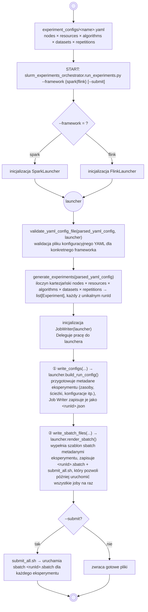
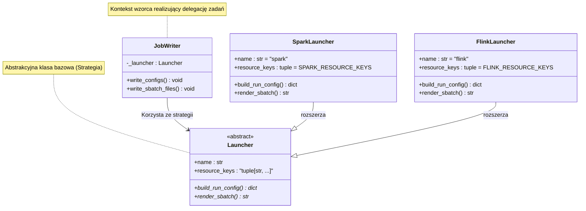
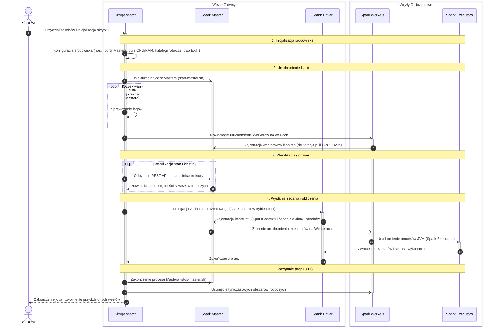
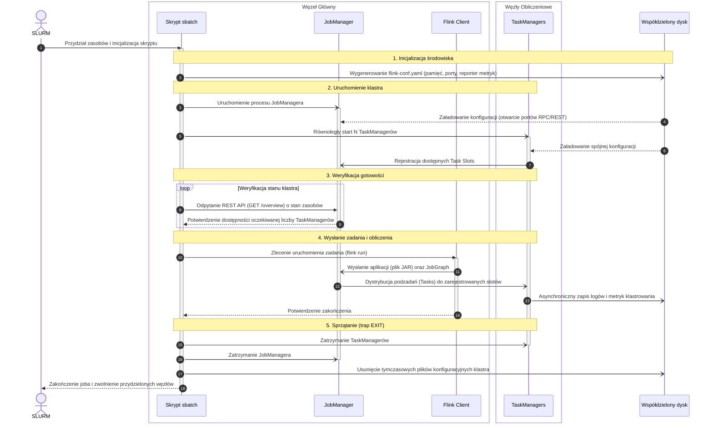

# clustering-algorithms-benchmark

Part of the Master thesis 'Performance and efficiency issues of the use of Big Data frameworks for implementation of clustering algorithms'. 

## Table of contents
* [General info](#general-info)
* [Architecture](#architecture)
* [Datasets](#datasets)
* [Project structure](#project-structure)
* [Requirements](#requirements)
* [Usage](#usage)


### General info
Engine-agnostic **benchmark harness** for the MSc thesis comparing clustering
algorithms on Big Data frameworks. This repo owns experiment orchestration, the
exchange **contract**, and result analysis. The actual algorithm implementations
live in the per-engine repos:

- [`spark-clustering-algorithms`](https://github.com/natix-x/spark-clustering-algorithms) — Scala / Spark
- [`flink-clustering-algorithms`](https://github.com/natix-x/flink-clustering-algorithms) — Java / Flink

A language-neutral JSON contract couples the harness with each engine jar: the harness
produces `run_config`, each engine consumes it and produces a result. The format, the
CORE vs ENGINE fields, and how conformance is validated are documented in
[`contract/README.md`](contract/README.md).

> **Note:** Some documentation and diagrams are in Polish, as the master thesis they accompany is written in Polish.

## Architecture

One experiment-matrix YAML fans out into many independent per-run jobs. The harness
is engine-agnostic; `--framework` picks a **Launcher** (Strategy) that owns every
Spark/Flink-specific detail.

### Flowchart:



### UML Class Diagram - Strategy Pattern


### Cluster topology on SLURM

Every generated `<runId>.sbatch` bootstraps a **throwaway standalone cluster on the
allocated nodes**, runs one job, then tears it down (`trap cleanup` on exit). There is
no external cluster manager — each SLURM job owns its cluster for its lifetime, which
keeps runs isolated and reproducible.

- **Spark** — a Master on the head node + one Worker per node (started via `srun`). The
  driver runs in client mode on the head node; executors are packed onto the Workers.
- **Flink** — a JobManager on the head node + one TaskManager per task (via `srun`).
  Job parallelism = total slots = `nodes × tm_per_node × cpus_per_task`.

<p align="center">
  <br>
  <em>Spark standalone cluster on a SLURM allocation (Ares), shown from the
  <strong>master–slave role</strong> perspective.</em>
</p>

<p align="center">
  <br>
  <em>Flink standalone session cluster on a SLURM allocation (Ares), shown from the
  <strong>physical-node</strong> perspective.</em>
</p>

#### Spark bootstrap (inside each `<runId>.sbatch`)

`spark-submit` runs in **client mode** on the head node; the trap tears the cluster
down on any exit.



#### Flink bootstrap (inside each `<runId>.sbatch`)
TODO: przyjrzyj jeszcze raz ten diagram - czy ma sens krok z ususwaniem TaskManagerów osobno ??? 

Standalone **session** cluster: `flink run` submits to the JobManager REST endpoint;
the trap stops all daemons on exit.



#### Flink one-time setup on Ares

Unlike Spark, Flink is **not** available as an Ares module,
and Flink loads metric reporters from its **own** classpath (`$FLINK_HOME/lib`) rather than
from the job jar. So a Flink installation and the reporter jar must be prepared **once per
install**, before the first run. The YAML `flink_home` points at this install
(e.g. `$SCRATCH/flink-1.17.1`).

**1. Install Flink on shared scratch.** Use 1.17.1 (matches the jar's `flink.version`) on
Java 11 — the common runtime with Spark 3.3, for a consistent comparison:

```bash
cd "$SCRATCH"
wget https://archive.apache.org/dist/flink/flink-1.17.1/flink-1.17.1-bin-scala_2.12.tgz
tar xzf flink-1.17.1-bin-scala_2.12.tgz        # -> $SCRATCH/flink-1.17.1 (= flink_home)
```

**2. Build and install the metric-reporter jar.** Built from the
`flink-clustering-algorithms` repo; it is slim (depends only on `flink-metrics-core`,
already shipped with Flink) and must live on the cluster classpath, not in the job jar:

```bash
cd /path/to/flink-clustering-algorithms/flink
mvn -o package
cd target/classes
jar cf ../flink-clustering-metrics-reporter.jar \
  clustering/metrics \
  META-INF/services/org.apache.flink.metrics.reporter.MetricReporterFactory
cp ../flink-clustering-metrics-reporter.jar "$SCRATCH/flink-1.17.1/lib/"
```

## Datasets

The benchmark runs on five public datasets. Their descriptions, sizes,
licenses, and preprocessing are documented in [`datasets/README.md`](datasets/README.md);
the preprocessing jobs live in `python/data_preprocessing/` with SLURM scripts in
`sbatch_scripts/`.

## Project structure

```
contract/                         # run_config.schema.json: the input contract (see contract/README.md)
experiment_configs/               # YAML experiment matrices (engine-neutral)
local_testing/experiment_configs/ # example per-run configs (contract fixtures)
python/
  slurm_experiments_orchestrator/ # job generation + submission (the harness)
    run_experiments.py            # CLI entry: --framework {spark,flink} <matrix>.yaml [--submit]
    common/                       # engine-agnostic: matrix expansion, YAML validation, config keys
    slurm/jobs_writer.py          # JobWriter (Strategy Context): delegates engine specifics
    launchers/
      base_launcher.py            # Launcher ABC (Strategy)
      __init__.py                 # get_launcher/available dict factory
      spark_launcher.py + spark_resources_resolver.py   # Spark sizing + config/sbatch
      flink_launcher.py           # Flink launcher
      sbatch_templates/           # spark_sbatch_template.py, flink_sbatch_template.py
  data_preprocessing/             # dataset preparation
  data_analysis/                  # result loading, metrics comparison, plots
tests/                            # pytest suite (validator, generator, launchers, contract)
media/                            # images, tables, etc. used accross repository
```

## Requirements

- Python 3.9+ 
- pyyaml
- jsonschema
- pandas
- numpy
- matplotlib
- pytest (for testing)

## Usage

Dependencies are managed with [uv](https://docs.astral.sh/uv/) (fast Python package
manager).

**1. Install uv** (once):

```bash
UV_VERSION="0.9.28" && curl -LsSf https://astral.sh/uv/${UV_VERSION}/install.sh | sh
```

See the [uv documentation](https://docs.astral.sh/uv/) if you hit any issues.

**2. Set up the environment:**

```bash
uv sync           
uv run pytest   
```

`uv sync` installs the runtime deps (`pyyaml`, `jsonschema`) plus the `dev` group
(`pytest`). Add `--extra analysis` for the analysis extras (`pandas`, `numpy`,
`matplotlib`).

**3. Generate / submit jobs.** On the cluster use the thin wrapper (`slurm_run.sh` just
sets `PYTHONPATH` and forwards args to the Python entrypoint):

```bash
# generate configs + sbatch, then submit all jobs:
./slurm_run.sh -f flink experiment_configs/flink_kmeans_example.yaml --submit

# or just generate (prints the submit_all.sh path to run later):
./slurm_run.sh -f spark experiment_configs/spark_kmeans_example.yaml
```

The experiment YAML format is documented in [`experiment_configs/README.md`](experiment_configs/README.md).
<br/>
You can also check out the real example config files that are provided in `experiment_configs/` directory.
