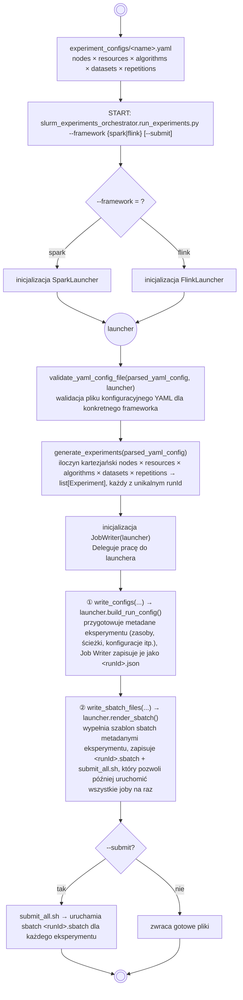

# clustering-algorithms-benchmark

Engine-agnostic **benchmark harness** for the MSc thesis comparing clustering
algorithms on Big Data frameworks. This repo owns experiment orchestration, the
exchange **contract**, and result analysis. The actual algorithm implementations
live in the per-engine repos:

- [`spark-clustering-algorithms`](https://github.com/natix-x/spark-clustering-algorithms) — Scala / Spark
- [`flink-clustering-algorithms`](https://github.com/natix-x/flink-clustering-algorithms) — Java / Flink

## How it fits together

One experiment-matrix YAML fans out into many independent per-run jobs. The harness
is engine-agnostic; `--framework` picks a **Launcher** (Strategy) that owns every
Spark/Flink-specific detail.

### Flowchart:



### UML Class Diagram - Strategy Pattern


### The contract (why this stays decoupled)

`contract/*.schema.json` is the single, language-neutral spec exchanged between the
three repos. The harness **produces** `run_config` JSON; each engine jar **reads** it
and **produces** `run_result` JSON:

```
                       contract/run_config.schema.json  ◄─ produced by harness
                                    ▲                       (checked in tests/)
   harness (Python) ───────────────┤
                                    ▼
   spark-clustering-algorithms (Scala)  ──►  contract/run_result.schema.json
   flink-clustering-algorithms (Java)   ──►         ▲ produced by each engine jar
                                                    └─ mirrored by hand in each repo
```

No shared JVM library: each engine keeps its own small parser and conforms to the
schema. Adding an engine = one `Launcher` subclass + its resource-key tuple + one
`_LAUNCHERS` entry — nothing in the harness core changes.

## Layout

```
contract/                         # JSON Schemas: the source of truth (see contract/README.md)
experiment_configs/               # YAML experiment matrices (engine-neutral)
analysis/                         # result analysis + plots
local_testing/experiment_configs/ # example per-run configs (contract fixtures)
python/slurm_experiments_orchestrator/
  run_experiments.py              # CLI entry: --framework {spark,flink} matrix.yaml [--submit]
  common/                         # engine-agnostic: matrix expansion, YAML validation, config keys
  slurm/jobs_writer.py            # JobWriter (Strategy Context): delegates engine specifics
  launchers/
    base_launcher.py              # Launcher ABC (Strategy)
    __init__.py                   # get_launcher/available dict factory
    spark_launcher.py + spark_resources_resolver.py   # Spark sizing + config/sbatch
    flink_launcher.py             # Flink launcher (sbatch is a Faza 3 TODO)
    sbatch_templates/             # spark_sbatch_template.py, flink_sbatch_template.py
tests/                            # pytest suite (validator, generator, launchers, contract)
```

## Usage

Dependencies are managed with [uv](https://docs.astral.sh/uv/):

```bash
uv sync                 # create .venv with runtime + dev deps
uv run pytest           # run the test suite
```

On the cluster, use the thin wrapper (`slurm_run.sh` just sets PYTHONPATH and forwards
args to the Python entrypoint):

```bash
# generate configs + sbatch, then submit all jobs:
./slurm_run.sh -f flink experiment_configs/flink_kmeans_example.yaml --submit

# or just generate (prints the submit_all.sh path to run later):
./slurm_run.sh -f spark experiment_configs/spark_kmeans_example.yaml
```

Input YAML is validated up front (`yaml_validator`). Generated per-run configs are
checked against the contract in the test suite (`tests/test_contract.py`), not at
runtime.

## Contract

See [`contract/README.md`](contract/README.md). In short: each engine jar reads the
same `RunConfig` JSON and writes the same `RunResult` JSON, so analysis is uniform
across engines. Fields are tagged CORE (engine-neutral, mandatory) vs ENGINE
(Spark-flavoured counters; Flink emits the analogue or 0).