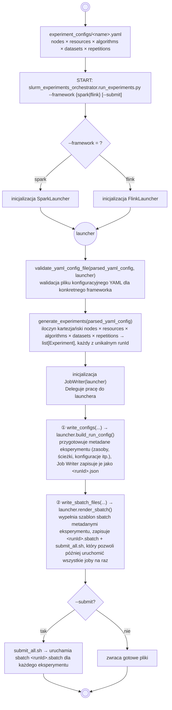
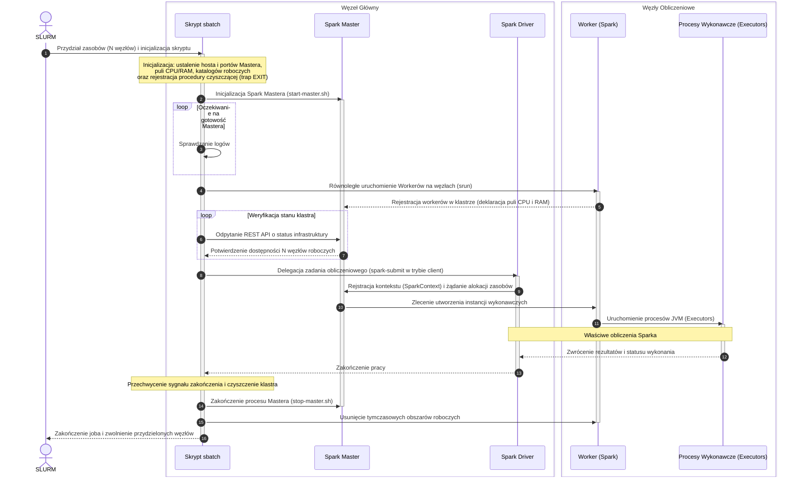

# clustering-algorithms-benchmark

Part of the Master thesis 'Performance and efficiency issues of the use of Big Data frameworks for implementation of clustering algorithms'. 

## Table of contents
* [General info](#general-info)
* [Architecture](#architecture)
* [Project structure](#project-structure)
* [Requirements](#requirements)
* [Usage](#usage)
* [Contract](#contract)


### General info
Engine-agnostic **benchmark harness** for the MSc thesis comparing clustering
algorithms on Big Data frameworks. This repo owns experiment orchestration, the
exchange **contract**, and result analysis. The actual algorithm implementations
live in the per-engine repos:

- [`spark-clustering-algorithms`](https://github.com/natix-x/spark-clustering-algorithms) — Scala / Spark
- [`flink-clustering-algorithms`](https://github.com/natix-x/flink-clustering-algorithms) — Java / Flink

## Architecture

One experiment-matrix YAML fans out into many independent per-run jobs. The harness
is engine-agnostic; `--framework` picks a **Launcher** (Strategy) that owns every
Spark/Flink-specific detail.

### Flowchart:



### UML Class Diagram - Strategy Pattern


### Cluster topology on SLURM

Every generated `<runId>.sbatch` bootstraps a **throwaway standalone cluster on the
allocated nodes**, runs one job, then tears it down (`trap cleanup` on exit). There is
no external cluster manager — each SLURM job owns its cluster for its lifetime, which
keeps runs isolated and reproducible.

- **Spark** — a Master on the head node + one Worker per node (started via `srun`). The
  driver runs in client mode on the head node; executors are packed onto the Workers.
- **Flink** — a JobManager on the head node + one TaskManager per task (via `srun`).
  Job parallelism = total slots = `nodes × tm_per_node × cpus_per_task`.

<p align="center">
  <br>
  <em>Spark standalone cluster on a SLURM allocation (Ares), shown from the
  <strong>master–slave role</strong> perspective.</em>
</p>

<p align="center">
  <br>
  <em>Flink standalone session cluster on a SLURM allocation (Ares), shown from the
  <strong>physical-node</strong> perspective.</em>
</p>

#### Spark bootstrap (inside each `<runId>.sbatch`)

`spark-submit` runs in **client mode** on the head node; the trap tears the cluster
down on any exit.



#### Flink bootstrap (inside each `<runId>.sbatch`)

Standalone **session** cluster: `flink run` submits to the JobManager REST endpoint;
the trap stops all daemons on exit.

```mermaid
---
config:
  layout: dagre
---
flowchart TB
    START_DOT((( ))) --> ENV

    ENV["module purge &amp;&amp; module load {java_module}<br>brak modułu Flink na Ares → własna instalacja FLINK_HOME + Java 11 (wspólny runtime ze Spark 3.3)"]
    CC["check_config()<br>sprawdza, czy &lt;runId&gt;.json istnieje"]
    SD["setup_dirs()<br>CLUSTERING_METRICS_FILE + FLINK_CONF_DIR na WSPÓŁDZIELONYM storage (Lustre),<br>by TaskManagery z innych węzłów widziały tę samą konfigurację"]
    CFG["configure_cluster()<br>JM_HOST = pierwszy węzeł, liczy TOTAL_TMS = nodes × tms_per_node oraz TOTAL_SLOTS"]
    WCONF["write_flink_conf()<br>dopisuje do flink-conf.yaml: rpc.address=JM_HOST, bind-host 0.0.0.0,<br>numberOfTaskSlots, pamięć JM/TM, parallelism, file metric reporter"]
    TRAP["trap cleanup EXIT INT TERM<br>rejestruje sprzątanie: taskmanager.sh stop-all + jobmanager.sh stop"]
    SJM["start_jobmanager()<br>jobmanager.sh start na węźle głównym"]
    STM["start_taskmanagers()<br>srun 1 TaskManager/task → taskmanager.sh start-foreground<br>-D taskmanager.host=$(hostname) (adres routowalny, nie loopback)"]
    WTM["wait_for_taskmanagers()<br>poll REST http://JM_HOST:8081/overview aż taskmanagers ≥ TOTAL_TMS (do 120 s)"]
    SUB["submit_job()<br>$FLINK_HOME/bin/flink run -m JM_HOST:8081 -p parallelism → jar --config &lt;runId&gt;.json"]
    CLEAN["cleanup() (na EXIT)<br>stop wszystkich TaskManagerów + JobManagera, usuwa tmp/conf, zwraca kod wyjścia"]

    ENV --> CC --> SD --> CFG --> WCONF --> TRAP --> SJM --> STM --> WTM --> SUB
    SUB --> CLEAN
    CLEAN --> END_DOT((( )))
```



#### Flink one-time setup on Ares

Ares has no Flink module (`module avail flink` is empty) and Flink loads metric reporters
from its **own** classpath (`$FLINK_HOME/lib`), not the job jar. So before the first run,
install Flink and drop the reporter jar into `lib/` (once per install; `flink_home` in the
YAML points here — e.g. `$SCRATCH/flink-1.17.1`):

```bash
# 1. Install Flink 1.17.1 (matches the jar's flink.version) on shared scratch, run on
#    Java 11 (the common runtime with Spark 3.3, for a consistent comparison).
cd "$SCRATCH"
wget https://archive.apache.org/dist/flink/flink-1.17.1/flink-1.17.1-bin-scala_2.12.tgz
tar xzf flink-1.17.1-bin-scala_2.12.tgz        # -> $SCRATCH/flink-1.17.1 (= flink_home)

# 2. Build the slim reporter jar from the flink-clustering-algorithms repo and install it
#    on the cluster classpath (depends only on flink-metrics-core, already in Flink).
cd /path/to/flink-clustering-algorithms/flink
mvn -o package
cd target/classes
jar cf ../flink-clustering-metrics-reporter.jar \
  clustering/metrics \
  META-INF/services/org.apache.flink.metrics.reporter.MetricReporterFactory
cp ../flink-clustering-metrics-reporter.jar "$SCRATCH/flink-1.17.1/lib/"
```

Two invariants the sbatch template and the Flink job enforce (misconfig fails fast rather
than silently under-reporting):

- **Shared metrics path** — each JobManager/TaskManager reporter writes `<path>.<uuid>`
  and the driver globs them, so `CLUSTERING_METRICS_FILE` must be on shared storage
  (Lustre `$SCRATCH`) visible to all nodes, else the driver sees only its own node.
- **Fresh cluster per run** — the reporter keeps a per-process peak map in memory, so a
  reused session cluster would accumulate metrics across runs. The template starts and
  tears down a cluster per job (teardown also triggers the reporter's final flush).

### The contract

`contract/*.schema.json` is the **single, language-neutral source of truth** for the
JSON exchanged between the three repos. Two schemas, one per direction:

- `run_config.schema.json` — the per-run input the harness **produces** and each engine
  jar **consumes** (via `--config <runId>.json`).
- `run_result.schema.json` — the result each engine jar **produces**, read uniformly by
  the analysis code.

```
                   run_config.schema.json                 run_result.schema.json
                          (input)                                (output)
   harness (Python)  ───writes──►  <runId>.json  ──►  engine jar  ───writes──►  <runId>.json (result)
                                                     (Spark / Flink)                    │
                                                                                        ▼
                                                                                 analysis (pandas)
```

The schema is **not a shared JVM library**: each engine keeps its own small
parser/serializer (Scala `case class`, Java POJO) that mirrors the schema by hand — no
cross-language build. Conformance is enforced by tests, not at runtime:

- harness side: `tests/test_contract.py` checks that every `build_run_config` output
  validates against `run_config.schema.json`;
- engine side: each engine repo validates a sample result against `run_result.schema.json`.

Adding an engine = one `Launcher` subclass + its resource-key tuple + one `_LAUNCHERS`
entry — nothing in the harness core changes.

## Project structure

```
contract/                         # JSON Schemas: the source of truth (see contract/README.md)
experiment_configs/               # YAML experiment matrices (engine-neutral)
local_testing/experiment_configs/ # example per-run configs (contract fixtures)
python/
  slurm_experiments_orchestrator/ # job generation + submission (the harness)
    run_experiments.py            # CLI entry: --framework {spark,flink} <matrix>.yaml [--submit]
    common/                       # engine-agnostic: matrix expansion, YAML validation, config keys
    slurm/jobs_writer.py          # JobWriter (Strategy Context): delegates engine specifics
    launchers/
      base_launcher.py            # Launcher ABC (Strategy)
      __init__.py                 # get_launcher/available dict factory
      spark_launcher.py + spark_resources_resolver.py   # Spark sizing + config/sbatch
      flink_launcher.py           # Flink launcher
      sbatch_templates/           # spark_sbatch_template.py, flink_sbatch_template.py
  data_preprocessing/             # dataset preparation
  data_analysis/                  # result loading, metrics comparison, plots
tests/                            # pytest suite (validator, generator, launchers, contract)
media/                            # images, tables, etc. used accross repository
```

## Requirements

- Python 3.9+ 
- pyyaml
- jsonschema
- pandas
- numpy
- matplotlib
- pytest (for testing)

## Usage

Dependencies are managed with [uv](https://docs.astral.sh/uv/) (fast Python package
manager).

**1. Install uv** (once):

```bash
UV_VERSION="0.9.28" && curl -LsSf https://astral.sh/uv/${UV_VERSION}/install.sh | sh
```

See the [uv documentation](https://docs.astral.sh/uv/) if you hit any issues.

**2. Set up the environment:**

```bash
uv sync           
uv run pytest   
```

`uv sync` installs the runtime deps (`pyyaml`, `jsonschema`) plus the `dev` group
(`pytest`). Add `--extra analysis` for the analysis extras (`pandas`, `numpy`,
`matplotlib`).

**3. Generate / submit jobs.** On the cluster use the thin wrapper (`slurm_run.sh` just
sets `PYTHONPATH` and forwards args to the Python entrypoint):

```bash
# generate configs + sbatch, then submit all jobs:
./slurm_run.sh -f flink experiment_configs/flink_kmeans_example.yaml --submit

# or just generate (prints the submit_all.sh path to run later):
./slurm_run.sh -f spark experiment_configs/spark_kmeans_example.yaml
```

Input YAML is validated up front (`yaml_validator`). Generated per-run configs are
checked against the contract in the test suite (`tests/test_contract.py`), not at
runtime.

## Contract

See [`contract/README.md`](contract/README.md). In short: each engine jar reads the
same `RunConfig` JSON and writes the same `RunResult` JSON, so analysis is uniform
across engines. Fields are tagged CORE (engine-neutral, mandatory) vs ENGINE
(Spark-flavoured counters; Flink emits the analogue or 0).